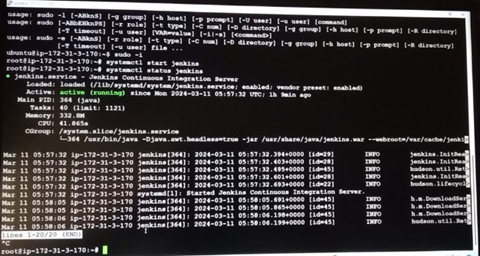
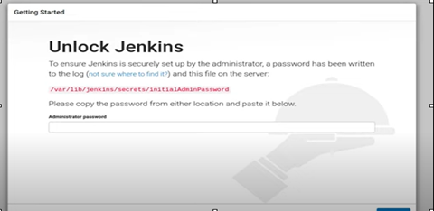
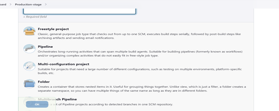
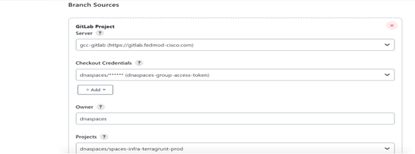
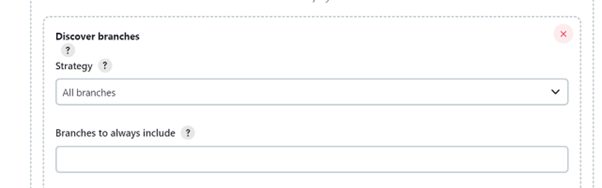
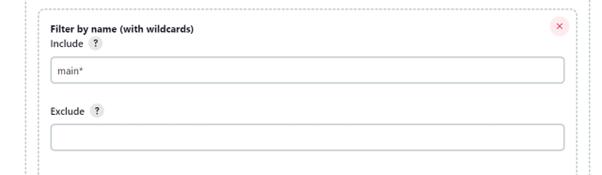
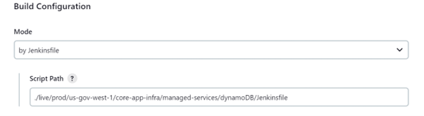
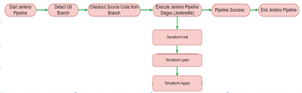
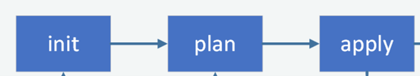

---
title :AWS Infrastructure deployment using terraform, Gitlab/Github and Jenkins CI\CD pipeline
---
## AWS Infrastructure deployment using terraform, Gitlab/Github and Jenkins CI\CD pipeline

### Introduction

## Jenkins
Jenkins is an open-source automation server that provides a way to automate parts of the software development process, including building, testing, and deploying software applications. It is a continuous integration and continuous delivery (CI/CD) tool that automates the software delivery process by allowing developers to build, test, and deploy code changes in a consistent and repeatable way. 
Jenkins enables teams to quickly detect and fix errors, streamline the development process, and ultimately deliver higher-quality software faster. 
It offers an extensive plugin ecosystem that supports integrations with a wide range of tools and technologies, making it a versatile and flexible tool for teams of all sizes and industries.

## Terraform
Terraform is an open-source infrastructure as code (IaC) tool used to manage and provision infrastructure resources across various cloud platforms, such as Amazon Web Services (AWS), Google Cloud Platform (GCP), and Microsoft Azure. 
It allows users to define infrastructure as code using a declarative language, which enables them to manage complex infrastructure deployments with ease. 
Terraform provides a consistent and repeatable way to create, modify, and destroy infrastructure resources, making it ideal for use in cloud-based environments. Its modular architecture and support for third-party plugins and providers make it a flexible and versatile tool for teams of all sizes and industries. With Terraform, users can automate the entire infrastructure lifecycle, from planning and design to deployment and scaling.

## GitLab
A web-based platform that offers a complete DevOps solution, including built-in CI/CD, issue tracking, and deployment tools. GitLab is a good choice for teams that want a self-hosted solution or prefer to keep everything in-house. GitLab also allows users to host a private version of GitLab on their own virtual machines.

## Github
A user-friendly platform that's known for its strong community and association with Apache projects. GitHub is a good choice for collaborative and open-source projects. GitHub also offers a marketplace with over 800 integrations and apps, and over 21k custom GitHub Actions.

## 1. Jenkins Deploy
**Launch an EC2 Instance**
1.	**Log in to the AWS Management Console.**
2.	**Navigate to the EC2 Dashboard and click on Launch Instance.**
3.	**Choose an Amazon Machine Image (AMI):**
    Select a suitable Linux distribution (e.g., Amazon Linux, Ubuntu).
4.	**Choose an Instance Type:**
           Select an instance type (e.g., t2.micro for testing).
5.	**Configure Instance:**
           Set up your instance details as needed.
6.	**Add Storage:**
            Modify storage options if necessary.
7.	**Configure Security Group:**
            Add rules to allow HTTP (port 80), HTTPS (port 443), and Jenkins (port 8080).
8.	**Launch the Instance:**
           Review and launch the instance, creating or selecting an existing key pair for SSH access.

**Install Jenkins**

- Before installing Jenkins, update your system’s package repositories to ensure you have the latest information about available packages.

   *sudo apt-get update/ sudo yum update*
- Jenkins requires Java to run. Most Linux distributions include OpenJDK in their package repositories.   

   *sudo apt-get install openjdk-8** */ sudo yum install java-11-openjdk*

   *apt-get install default-jdk*

**Add jenkins repo**

*sudo wget -O /etc/yum.repos.d/jenkins.repo https://pkg.jenkins.io/redhat-stable/jenkins.repo*

**Install jenkins**

*sudo yum install jenkins*

**Start and enable the Jenkins service**

*sudo systemctl start jenkins*

*sudo systemctl enable jenkins*



Reference link: <https://www.digitalocean.com/community/tutorials/how-to-install-jenkins-on-ubuntu-22-04>

**Access Jenkins**

Jenkins installation is completed take public Ip: port id (8080)

You will be prompted to unlock Jenkins. To get the initial admin password, run:

*sudo cat /var/lib/jenkins/secrets/initialAdminPassword*



Copy the password and paste it into the setup wizard.

Follow the setup wizard to install suggested plugins and create an admin user.
Configure your Jenkins instance as needed.

## 2. Runners

In Jenkins, runners are typically referred to as **agents** or **nodes**:

- **Master Node:** The main Jenkins server that manages the jobs.
- **Agent Nodes:** These execute the jobs assigned by the master. They can be physical machines, virtual machines, or cloud instances.You can set up agents to distribute workload and run builds in parallel, improving efficiency.

## 3. Pipelines

**Pipeline as Code:** Jenkins Pipelines allow you to define your build process as code using a domain-specific language (DSL).

**Types of Pipelines:**

- **Declarative Pipeline:** A simpler and more structured way to write pipelines.
- **Scripted Pipeline:** More flexible, but requires more programming knowledge.

**Basic Structure of a Declarative Pipeline:**
```
pipeline {
    agent any 
    stages {
        stage('Build') {
            steps {
                // Commands to build your application
            }
        }
        stage('Test') {
            steps {
                // Commands to test your application
            }
        }
        stage('Deploy') {
            steps {
                // Commands to deploy your application
            }
        }
    }
}
```
**Additional Resources**

- **Jenkins Plugins:** Explore the Jenkins Plugin Index to enhance functionality.
- **Jenkinsfile:** A file where you define your pipeline script, typically stored in your version control system.

**Pipeline Creation:**

**Prerequisites**

Before using this pipeline, ensure you have the following:

- Jenkins server set up and running.
- Jenkins plugins installed for Gitlab/Github integration and Terraform support.
- Terraform installed on the Jenkins agent.

  Navigate to the Jenkins dashboard, click on "New Item," provide the name.

**Pipeline steps and procedure**

**Create a New Pipeline Project:**

- Navigate to Jenkins dashboard.
- Click on **New Item**.
- Enter a name for your project name and select **Pipeline**.



**Configure Source Code Management:**

- Under **Branch Sources**, add your Git repository.
- Configure credentials and owner name.
- Under project select your repository.

 

**Discover Branches:**

- Under strategy select all branches.



**Filter by name(wildcards):**

- Here you can select branches. we are working main branch.



**Build Configuration:**

- Selecting the Jenkinsfile path in build configuration specifies the location within your project's repository where Jenkins can find the pipeline script (Jenkinsfile).



**Next save your configuration.**

**Run the Pipeline:**

- It will execute terraform init, terraform plan, and terraform apply stages according to the Jenkinsfile defined.



**console output/ Open blue ocean** to see the stages of the Pipeline.



Once the job is triggered, you will be informed of its status, either passed or failed. If the job fails, please review the Jenkins console logs and take the necessary appropriate actions. 